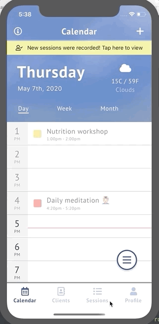
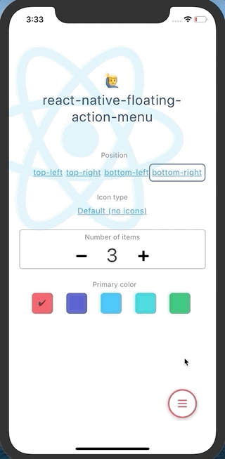
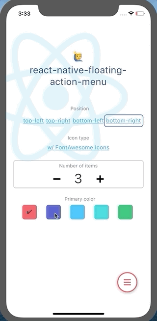

<div align="center">
  <h1>react-native-floating-action-menu</h1>
  
  <div>B-Y-O-I (bring your own icon) javascript component for react-native. No dependencies. Inspired by material-design's Floating Action Button. Please customize to your needs and enjoy. PRs are welcome!</div>
  
  <br/>

  
</div>

## Installation

```
npm install --save react-native-floating-action-menu
```

## Usage

```JSX
import { FloatingMenu } from 'react-native-floating-action-menu';

const items = [
  { label: 'Do a little dance' },
  { label: 'Make a lil love' },
  { label: 'Get down tonight' },
];

<FloatingMenu
  items={items}
  isOpen={this.state.isMenuOpen}
  onMenuToggle={this.handleMenuToggle}
  onItemPress={this.handleItemPress}
/>
```

## Item Config

*FloatingItem*

Prop | description | type | required
--- | --- | --- | ---
label | text to display alongside button | string | ✔︎
labelStyle | style for the Text element | object | 
isPending | will display ActivityIndicator in place of icon when `isPending` is true | boolean | 
isDisabled | will disable the item when `isDisabled` is true | boolean | 
onPress | callback function called when this item is pressed. This will override the default `onItemPress` callback given to FloatingMenu | function |

Example:

```JSX
{
  label: 'Hello world',
  isPending: false,
  isDisabled: false,
  onPress: (item, index) => {}, // (optional, can also be handled via `onItemPress`)
  // Anything else you want goes here
}
```

## Menu Config

Prop | description | type | default 
--- | --- | --- | ---
items | array of `Item`s (See above). Items are positioned by their order in this array and start closest to the menu button. | FloatingItem[] | []
isOpen | control the menu open/closed state | boolean | false
position | "top-left" \| "top-right" \| "bottom-left" \| "bottom-right" | string | "bottom-right"
primaryColor | hex color string | string | "#213A77"
buttonWidth | width (and also height) of the button | number | 50
dimmerStyle | style the background dimmer element | object | -
openEase | function used to ease the opening animation (see [js easing functions](https://gist.github.com/gre/1650294)) | function | <pre>`t => (--t) * t * t + 1`</pre>
closeEase | function used to ease the closing animation (see [js easing functions](https://gist.github.com/gre/1650294)) | function | <pre>t => t * t * t</pre>
renderMenuIcon | function used to render the icon for menu button. Receives current menu state as an argument. (see below example) | function | -
renderItemIcon | function used to render the icon for the items. Receives item, index, and current menu state as arguments. (see below example) | function | -
onMenuToggle | callback function called when the menu has been toggled open or closed. Receives a boolean value | function | -
onItemPress | callback function called when a menu item has been pressed. Receives item and index. If an item specifies its own `onPress` function, it will take priority, and this function will be ignored | function | -

## Gif Demos

<table>
<thead />
<tbody>
<tr>
  <td width="25%">
    <p><b>Positions</b></p>
    
  </td>
  <td width="25%">
    <p><b>FontAwesome</b></p>
    
  </td>
  <td width="25%">
    <p><b>Colors</b></p>
    
  </td>
  <td width="25%">
    <p><b>List lengths</b></p>
    
  </td>
</tr>
</tbody>
</table>

## Quick Start Example

```JSX
import React from 'react';
import { StyleSheet } from 'react-native';
import { FloatingMenu } from 'react-native-floating-action-menu';

const items = [
  { label: 'Do a little dance' },
  { label: 'Make a lil love' },
  { label: 'Get down tonight' },
];

class MyScreen extends React.Component {
  state = {
    isMenuOpen: false,
  };

  handleMenuToggle = isMenuOpen =>
    this.setState({ isMenuOpen });

  handleItemPress = (item, index) =>
    console.log('pressed item', item);

  render() {
    return (
      <View style={styles.container}>
        <FloatingMenu
          isOpen={this.state.isMenuOpen}
          items={items}
          onMenuToggle={this.handleMenuToggle}
          onItemPress={this.handleItemPress}
        />
      </View>
    );
  }
};

const styles = StyleSheet.create({
  container: {
    width: '100%',
    height: '100%',
    position: 'relative',
  },
});

export default MyScreen;

```

## Example rendering icons (FontAwesome, regular Images)

```JSX
import { Image } from 'react-native';
import { FloatingMenu } from 'react-native-floating-action-menu';
import { FontAwesomeIcon } from '@fortawesome/react-native-fontawesome';
import { faBars, faTimes, faUserPlus } from '@fortawesome/free-solid-svg-icons';

// Specify data required to render the icon
const items = [
  {
    label: 'First is an icon',
    fa: faUserPlus
  },
  {
    label: 'Second is an image',
    image: require('../assets/img-0.png')
  },
];
// Optional color to be silly
const primaryColor = '#09f';

class MyScreen extends React.Component {
  state = {};

  renderMenuIcon = (menuState) => {
    const { menuButtonDown } = menuState;

    return menuButtonDown
      ? <Image source={require('./btn-down.png')} />
      : <Image source={require('./btn-up.png')} />;
  }
  
  renderItemIcon = (item, index, menuState) => {
    const { itemsDown, dimmerActive } = menuState;

    const isItemPressed = itemsDown[index];
    const color = isItemPressed ? '#fff' : primaryColor;

    // Icons can be rendered however you like.
    // Here are some examples, using data from the item object:

    if (item.fa) {
      return (
        <FontAwesomeIcon
          icon={item.fa}
          size={25}
          color={color}
        />
      );
    }
    else if (item.image) {
      return (
        <Image
          source={item.image}
          style={{ tintColor: color }}
          resizeMode="contain"
        />
      );
    }

    return null;
  };

  ...

```

## Run Example

- git clone https://github.com/nicotroia/react-native-floating-action-menu
- cd react-native-floating-action-menu/example
- npm install
- npm run ios # or android

## Develop

- `npm pack`
- `cd example`
- `npm install ../react-native-floating-action-menu.tgz --save`
- `npm run ios` # or android

## License

MIT © 2019-2020 [Nico Troia](https://nicotroia.com)
